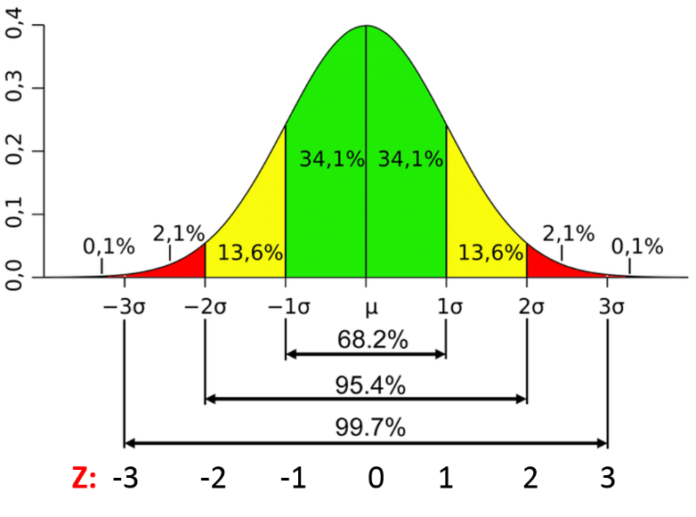

# Prerequisite Knowledge

Introduction to Linear Regression

::: fragment
- The *linear regression*: $Y = \beta_0 + \beta_1 X_1 + \varepsilon$, with $E[\varepsilon|X_1] = 0$
- Estimate the regression line (least square)
- Use SLR to model the relation between the response and a continuous/categorical explanatory variable
- Interprete the output of the SLR
::: 


## The basic idea of residual analysis

Not all of the data points in a sample will fall right on the least squares regression line. 

<div class='left' style='float:left;width:48%'>

**residual**:The vertical distance between any one data point $y_i$ and its estimated value $\hat{y}_i$ 

$$
e_i =y_i-\hat{y}_i
$$
Residuals can be thought of as an estimate of the actual unknown **true error** term:

$$
\varepsilon_i =Y_i-E(Y_i)
$$

</div>

<div class='right' style='float:right;width:52%'>

```{r include=FALSE}
library(readr)
library(ggpmisc)
library(tidyverse)
library(ggplot2)
library(ggbrace) #devtools::install_github("nicolash2/ggbrace")
library(cowplot)
source("functions/residplot.R")
satgpa <- read_csv("data/satgpa.csv")
fit <- lm(fy_gpa ~ hs_gpa, data = satgpa)  # Fit the model
summary(fit)
set.seed(123)
sample_100<- sample_n(satgpa, 100)

main <- ggplot(satgpa,aes(hs_gpa, fy_gpa))+geom_point(shape=21)+
  geom_smooth(method = lm, se = FALSE,formula= y~x, color="steelblue")+
  labs(x="High school GPA", y="First year (college) GPA")+
  theme_cowplot()

main.samp <- main +
  geom_point(data=sample_100, aes(hs_gpa, fy_gpa), color="darkgreen")+
  geom_smooth(data=sample_100, aes(hs_gpa, fy_gpa),method = lm,formula = y~x, se = FALSE, color="darkgreen")
```

```{r echo=FALSE, fig.height=4, fig.width=6, message=FALSE, warning=FALSE}
main.samp+
  scale_x_continuous(limits = c(2,2.51))+
  annotate("text", x = 2.04, y = 1.7, label = "Population", color="steelblue") +
   annotate("text", x = 2.03, y = 1.0, label = "Sample", color="darkgreen") +
 geom_brace(aes(c(2.205,2.225), c(1.62, 2.39), label="Residual\nerror"),mid=0.65, inherit.data=F, 
            rotate=90,labelsize=4, color="darkgreen",fontface="bold")+
   geom_brace(aes(c(2.175,2.195), c(1.8, 2.39), label="True error"), inherit.data=F, 
            rotate=270,labelsize=4, color="steelblue",fontface="bold")+labs(x="x", y="y")

```

</div>
 
## Learning Outcomes

by the end of the SLR Model Assumptions & Diagnostics, students should be able to:

<font size="6">

::: nonincremental
- **List 4 things that can go wrong with the linear regression model.**
- **Summarize how to detect various problems with the model using a residuals vs. fits plot.**
- Describe various problems with the model using a residuals vs. predictor plot.
- Analyze a residuals vs. order plot to detect a certain kind of dependent error terms.
- Know how we can detect non-normal error terms using a normal probability plot.
- Summarize why we need to check the assumptions of our model.
::: 

</font>

# Start of the Demo Lesson

## SLR Model Assumptions & Diagnostics


**Learning Outcomes**

- List 4 things that can go wrong with the linear regression model.

::: nonincremental
Using visual analysis of the residuals vs fit plot:

- Summarize how to detect various problems with the model using a residuals vs. fits plot.

:::

## Recall from a previous lecture

<div class='left' style='float:left;width:48%'>

<font size="6">
Recall that the four conditions ("**LINE**") that comprise the simple linear regression model:

- **L**inear Function: The mean of the response, $E(Y_i)$, at each value of the predictor, $x_i$, is a linear function of the $x_i$ 
- **I**ndependent: The errors, $\varepsilon_i$, are Independent.
- **N**ormally Distributed: The errors, $\varepsilon_i$, at each value of the predictor, $x_i$, are normally distributed.
- **E**qual variances: The errors, $\varepsilon_i$, at each value of the predictor, $x_i$, have equal variances (denoted $\sigma^2$).

</div>
<div class='right' style='float:right;width:48%'>

::: fragment

The four conditions of the model pretty much tell us what can go wrong with our model:

- The population regression function is **not linear**. That is, the response is not a function of linear trend $(\beta_0 +\beta_1x_i)$ plus some error $\varepsilon_i$.
- The error terms are **not independent**.
- The error terms are **not normally distributed**.
- The error terms do **not** have **equal variance**.

::: 

</div>
</font>


# Residuals vs. Fits Plot

"Residuals vs fits plot" is the most frequently created plots.

- It is a scatter plot of residuals on the y axis and fitted values on the x-axis. 

. . .


```{r echo=FALSE, fig.height=4, fig.width=8, message=FALSE, warning=FALSE}
ggplot(fit, aes(.fitted, .resid))+geom_point()+
  #stat_smooth(method="loess")+geom_hline(yintercept=0, col="red", linetype="dashed")+
  xlab("Fitted values")+ylab("Residuals")+
  geom_hline(yintercept=0, col="steelblue", linetype="dashed", lwd=1)+
  ggtitle("Residual vs Fits Plot")+theme_cowplot()
```

**The plot is used to detect non-linearity, unequal error variances, and outliers.**

-------------------------------------------------------------------

<div class='left' style='float:left;width:48%'>

Example: "well-behaved" residual plot.

```{r alchoholarm, echo=FALSE, fig.height=3, fig.width=6, message=FALSE, warning=FALSE}
alchoholarm <- read_table("data/alcoholarm.txt") |> arrange(alcohol)
sub.alchoholarm <- alchoholarm[1:6,]


alcreg.plt<- ggplot(alchoholarm ,aes(y=strength, x=alcohol))+geom_point()+
  geom_smooth(method = lm,formula=y~x, se = FALSE, color="steelblue")+
  #geom_point(data=sub.alchoholarm, aes(y=strength, x=alcohol), size=2, color= "darkred")+
  labs(x="Lifetime consumption of alcohol", y="Muscle Strength", title= "Regression Plot",
       subtitle="Does alcohol consumption is linearly related to muscle strength?", 
       caption ="Urbano-Marquez, et al. 1989")+
  theme_cowplot()
alcreg.plt
```


- Decreasing linear relationship between alcohol and arm strength. 
- No unusual data points in the data set. 
- Variation around the estimated regression line is constant 

</div>

<div class='right' style='float:right;width:48%'>

::: fragment

Residuals vs Fits plot looks like

```{r echo=FALSE, fig.height=3, fig.width=6,  message=FALSE, warning=FALSE}
fit2 <- lm(strength~alcohol, alchoholarm)
sub <- cbind(x=alchoholarm$alcohol,fit.x= fit2$fitted.values,res=fit2$residuals) |> as_tibble()
fit2.sub<- sub[1:6,]
alc.fit.res<- ggplot(fit2, aes(.fitted, .resid))+geom_point()+
  #stat_smooth(method="loess")+
  geom_hline(yintercept=0, col="steelblue", linetype="dashed", lwd=1)+
  #geom_point(data=fit2.sub, aes(y=res, x=fit.x), size=2, color= "darkred")+
  xlab("Fitted values")+ylab("Residuals")+
  ggtitle("Residual vs Fits Plot")+theme_cowplot()
alc.fit.res
```


- Residuals "bounce randomly"  $\rightarrow$ assumption that the relationship is linear is reasonable.
- Residuals roughly form a "horizontal band" $\rightarrow$the variances of the error terms are equal.
- No residual "stands out" from the basic random pattern $\rightarrow$ there are no outliers.

:::

</div>

## Identifying Specific Problems Using Residual Plots

To detect problems with our formulated regression model:

::: nonincremental
1.  How does a non-linear regression function show up on a residual vs fits plot?
:::


<div class='left' style='float:left;width:48%'>

```{r fig.height=3, fig.width=6, echo=FALSE,  message=FALSE, warning=FALSE}
treadwear <- read_table("data/treadwear.txt") 
model.tread <- lm(groove ~ mileage, data=treadwear)
#summary(model.tread )


treadwear.plt<- ggplot(treadwear  ,aes(x=mileage, y=groove))+
  geom_point()+
  geom_smooth(method = lm, se = FALSE, color="steelblue")+
  theme_cowplot()+
    labs(x= "Mileage (1000s of miles)",
       y="Depth of groove (mils)",
       subtitle = "Is tire treadwear linearly related to mileage?",
       title="Residual vs Fitted Plot")+
  stat_poly_eq(formula = y ~x, 
                aes(label = paste(..eq.label.., ..rr.label.., sep = "~~~")), 
                parse = TRUE)   
treadwear.res.plt<- ggplot(model.tread, aes(.fitted, .resid))+
  geom_point() +
  geom_hline(yintercept=0, col="steelblue", linetype="dashed", lwd=1) +
  labs(x= "Fitted values",
       y="Residuals",
       title="Residual vs Fitted Plot")+
theme_cowplot()

#plot_grid(treadwear.plt, treadwear.res.plt, ncol=2)
treadwear.plt
```

</div>
<div class='right' style='float:right;width:48%'>

::: fragment
```{r fig.height=3, fig.width=6, echo=FALSE,  message=FALSE, warning=FALSE}
treadwear.res.plt
```

:::

</div>

::: fragment
**Answer:**  The residuals depart from 0 in some systematic manner (non-random). Such pattern is sufficient to suggest that the regression function is not linear.
:::

----------------------------------------------------------

But wait... $R^2$ is looking so nice. What does the $R^2$ tells you?

```{r echo=FALSE, fig.height=4, fig.width=5, message=FALSE, warning=FALSE}
treadwear.plt
```

- Large $R^2$ value should not be interpreted as meaning that the estimated regression line fits the data well." 
- Large $R^2$ value tells you that if you wanted to predict groove depth, you'd be better off taking into account mileage than not. 
- residuals vs. fits plot: prediction would be better if you formulated a non-linear model

--------------------------------------------------------------------

::: nonincremental
2.  How does non-constant error variance show up on a residual vs fits
    plot?
:::


<div class='left' style='float:left;width:48%'>
```{r fig.height=3, fig.width=6, echo=FALSE,  message=FALSE, warning=FALSE}
realestate <- read_table("data/realestate.txt")

model.realestate <- lm(SalePrice ~ SqFeet, data=realestate)
#summary(model.realestate )


realestate.plt<- ggplot(realestate ,aes(x=SqFeet, y=SalePrice))+
  geom_point()+
  geom_smooth(method = lm, se = FALSE, color="steelblue")+
  labs(x="Home area (sq ft)", y="Home's Sale Price")+ 
  theme_cowplot()
realestate.res.plt<-ggplot(model.realestate, aes(.fitted, .resid))+geom_point()+
  geom_hline(yintercept=0, col="steelblue", linetype="dashed", lwd=1)+
  xlab("Fitted values")+ylab("Residuals")+
  ggtitle("Residual vs Fitted Plot")+theme_cowplot()

#plot_grid(realestate.plt, realestate.res.plt, ncol=2)
realestate.plt
```
</div>
<div class='right' style='float:right;width:48%'>

::: fragment
```{r fig.height=3, fig.width=6, echo=FALSE,  message=FALSE, warning=FALSE}
realestate.res.plt
```

:::
</div>

::: fragment
**Answer:** Non-constant error variance shows up on a residuals vs. fits (or predictor) plot in any of the following ways:

-   "**fanning**" effect: residuals are close to 0 for small $x$ values and are more spread out for large $x$
    values.
-   "**funneling**" effect:  residuals are spread out for small $x$ values and close to 0 for large $x$ values.
-   spread of the residuals varies in some complex fashion.
:::


------------------------------------------------------

::: nonincremental
3.  How does an outlier show up on a residual vs. fits plot?
:::


<div class='left' style='float:left;width:48%'>
```{r fig.height=3, fig.width=6, echo=FALSE,  message=FALSE, warning=FALSE}
alcoholtobacco <- read_csv("data/alcoholtobacco.csv")
alcoholtobacco.sub <- alcoholtobacco |> filter(Region=="NorthernIreland")

model.alcoholtobacco <- lm(Alcohol ~ Tobacco, data=alcoholtobacco)

#summary(model.alcoholtobacco )


alcoholtobacco.plt<- ggplot(alcoholtobacco ,aes(x=Tobacco, y=Alcohol))+
  geom_point()+
  geom_smooth(method = lm, se = FALSE, color="steelblue")+
  geom_point(data=alcoholtobacco.sub, aes(x=Tobacco, y=Alcohol), size=2, color= "purple")+
  labs(x="Avg weekly tobacco expenditure (GBP)", y="Avg weekly alcohol \nexpenditure (GBP)",
       subtitle="Is there a relationship between tobacco use and alcohol use?")+ 
  theme_cowplot()
alcoholtobacco.res.plt<-ggplot(model.alcoholtobacco, aes(.fitted, .resid))+geom_point()+
  geom_hline(yintercept=0, col="steelblue", linetype="dashed", lwd=1)+
  xlab("Fitted values")+ylab("Residuals")+
  ggtitle("Residual vs Fitted Plot")+theme_cowplot()

#plot_grid(alcoholtobacco.plt, alcoholtobacco.res.plt, ncol=2)
alcoholtobacco.plt
```

</div>
<div class='right' style='float:right;width:48%'>

::: fragment
```{r fig.height=3, fig.width=6, echo=FALSE,  message=FALSE, warning=FALSE}
alcoholtobacco.res.plt
```

:::
</div>

::: fragment
**Answer:** The observation's residual stands apart from the basic random pattern of the rest of the residuals. The random pattern of the residual plot can even disappear if one outlier really deviates from the pattern of the rest of the data.
:::

---------

<div class='left' style='float:left;width:48%'>
```{r echo=FALSE, fig.height=4, fig.width=6, message=FALSE, warning=FALSE}

alcoholtobacco.plt<- ggplot(alcoholtobacco ,aes(x=Tobacco, y=Alcohol))+
  geom_point()+
  geom_smooth(method = lm, se = FALSE, color="steelblue")+
  geom_point(data=alcoholtobacco.sub, aes(x=Tobacco, y=Alcohol), size=2, color= "purple")+
  labs(x="Alchohol consumption", y="Ave weekly alcohol \nexpenditure (GBP)")+ 
  theme_cowplot()+
  stat_poly_eq(formula = y ~x, 
                aes(label = paste(..eq.label.., ..rr.label.., sep = "~~~")), 
                parse = TRUE) 
alcoholtobacco.plt
```
</div>
<div class='right' style='float:right;width:48%'>
```{r echo=FALSE, fig.height=4, fig.width=6, message=FALSE, warning=FALSE}
model.alcoholtobacco.sub <- lm(Alcohol ~ Tobacco, data=alcoholtobacco |> filter(Region !="NorthernIreland"))


alcoholtobacco.sub.plt <- alcoholtobacco |> filter(Region !="NorthernIreland") |>  ggplot( aes(x=Tobacco, y=Alcohol))+
  geom_point()+
  geom_smooth(method = lm, se = FALSE, color="steelblue")+
  labs(x="Alchohol consumption", y="")+ 
  theme_cowplot()+
  stat_poly_eq(formula = y ~x, 
                aes(label = paste(..eq.label.., ..rr.label.., sep = "~~~")), 
                parse = TRUE) 
alcoholtobacco.sub.plt

```

</div>

- coefficient of determination can be greatly affected by just one data
point.  

- alcohol vs tobacco plot The value has jumped from 5% ("no-relationship")
to 62% ("moderate relationship")! 

-------------------------------------------------------------------

How large a residual has to be before a data point should be flagged as being an outlier?

- Not straightforward: the magnitude of the residuals depends on the units of the response variable.
- We can make the residuals "unitless" by dividing them by their standard deviation: "**standardized residuals**."
- How many standard deviations above or below a data point is from the estimated regression line.

::: fragment

```{r echo=FALSE, fig.height=4, fig.width=5, message=FALSE}
ggplot(data = model.alcoholtobacco, aes(fitted(model.alcoholtobacco), rstandard(model.alcoholtobacco)))+geom_point()+
  geom_hline(yintercept=0, col="steelblue", linetype="dashed", lwd=1)+
  xlab("Fitted values")+ylab("Standardized residuals")+
  ggtitle("Residual vs Fitted Plot")+theme_cowplot()
```
:::

--------------------------------------------------------------------

- Recall: data that are normally distributed, 95% of the measurements fall within 2 standard deviations of the mean. 
- standardized residual greater than 2 or smaller than -2 might be **flagged for further investigation**. 

{width=50%}


# Conclusions

Which assumptions can be checked with residuals vs fits plots?

- **L**inear Function
- **I**ndependent
- **N**ormaly distributed
- **E**qual variances


# Extra

## Residuals vs. Predictor Plot

An alternative to the residuals vs. fits plot is a "**residuals vs. predictor plot**." 

- It is a scatter plot of residuals on the y-axis ($\varepsilon_i =y_i-\hat{y}_i$) and the predictor ($x$) values on the x-axis. 

```{r echo=FALSE, fig.height=3, fig.width=8, message=FALSE, warning=FALSE}
alc.pred.res<-ggplot(alchoholarm, aes(alcohol, residuals(fit2)))+geom_point()+
  geom_hline(yintercept=0, col="steelblue", linetype="dashed", lwd=1)+
  labs(x="Lifetime consumption of alcohol",y="Residuals",title="Residual vs Predictor Plot")+theme_cowplot()
alc.pred.res
```

--------------------------------------------------------

<div class='left' style='float:left;width:48%'>

```{r fig.height=7, fig.width=5, echo=FALSE,  message=FALSE, warning=FALSE}
cowplot::plot_grid(alcreg.plt+ geom_point(data=sub.alchoholarm, aes(y=strength, x=alcohol), size=2, color= "purple") ,
  alc.fit.res,
  alc.pred.res, 
  ncol=1)
```

</div>

<div class='right' style='float:right;width:48%'>

</br>
</br>

- Were would you find the 6 purple dots shown in regression plot on:

a) Residual vs Fits Plot?
b) Residual vs Predictor Plot?

</div>


--------------------------------------------------------

<div class='left' style='float:left;width:48%'>

```{r fig.height=7, fig.width=5, echo=FALSE,  message=FALSE, warning=FALSE}
cowplot::plot_grid(alcreg.plt+ geom_point(data=sub.alchoholarm, aes(y=strength, x=alcohol), size=2, color= "purple") ,
  alc.fit.res+geom_point(data=fit2.sub, aes(y=res, x=fit.x), size=2, color= "purple"),
  alc.pred.res+  geom_point(data=fit2.sub, aes(y=res, x=x), size=2, color= "purple"), 
  ncol=1)
```

</div>

<div class='right' style='float:right;width:48%'>

</br>
</br>

- In essence, for this example, the residuals vs. predictor plot is just a mirror image of the residuals vs. fits plot. 
- if the predictor is the **same predictor** that is used in the regression model, the plot offers **no new information**
- if the predictor is a **new predictor**, plot can help to determine whether the predictor should be added to the model

</div>

--------------------------------------------------------

Let's take a look at an example in which the residuals vs. predictor plot is used to determine whether or not another predictor should be added to the model. 

```{r include=FALSE}
bloodpress <- read_table("data/bloodpress.txt") |> arrange(Age)
model.1 <- lm(BP ~ Age, data=bloodpress)
model.2 <- lm(BP ~ Weight, data=bloodpress)
model.3 <- lm(BP ~ Dur, data=bloodpress)
summary(model.1)
```


```{r bloodpress,fig.height=4, fig.width=10, echo=FALSE,  message=FALSE, warning=FALSE}


bloodpress.plt1<- ggplot(bloodpress ,aes(x=Age, y=BP))+
  geom_point()+
  geom_smooth(method = lm, se = FALSE, color="steelblue")+
  labs(x=" Age (years)", y="Diastolic blood pressure (mm Hg)")+ 
  theme_cowplot()
bloodpress.plt2<- ggplot(bloodpress ,aes(x=Weight, y=BP))+
  geom_point()+
  geom_smooth(method = lm, se = FALSE, color="steelblue")+
  labs(x="Weight (pounds)", y="Diastolic blood pressure (mm Hg)")+ 
  theme_cowplot()
bloodpress.plt3<- ggplot(bloodpress ,aes(x=Dur, y=BP))+
  geom_point()+
  geom_smooth(method = lm, se = FALSE, color="steelblue")+
  labs(x=" Duration of hypertension (years)", y="Diastolic blood pressure (mm Hg)")+ 
  theme_cowplot()
plot_grid(bloodpress.plt1,bloodpress.plt2,bloodpress.plt3, ncol=3)
```

. . .

In summary, it appears as if weight has the strongest association     with diastolic blood pressure, age has the second strongest association, and duration the weakest.

---------------------------------------------------------------------

```{r echo=FALSE, fig.height=4, fig.width=8}
ggplot(bloodpress, aes(Weight, residuals(model.1)))+geom_point()+
  #stat_smooth(method="loess")+
  geom_hline(yintercept=0, col="steelblue", linetype="dashed", lwd=1)+
  xlab("Weight (pounds)")+ylab("Residuals from model \nwith Age")+
  ggtitle("Residual vs Predictor Plot",
          subtitle = "model: BP ~ Age")+theme_cowplot()
```

- You can think of the residuals on the y axis as a "new response," = individual's diastolic blood pressure adjusted for their age.
- "new response" against a predictor shows a non-random pattern
- Adding the predictor weight to the model already containing age would help to explain some of the remaining variability in the response.

------------------------------------------------------------------------------------------------

Suppose we fit the model with blood pressure as the response and age and weight as the two predictors. Should we also add the predictor duration to the model? 

```{r echo=FALSE, fig.height=4, fig.width=8}
model.12 <- lm(BP ~ Age + Weight, data=bloodpress)
ggplot(bloodpress, aes(Dur, residuals(model.12)))+geom_point()+
  #stat_smooth(method="loess")+
  geom_hline(yintercept=0, col="steelblue", linetype="dashed", lwd=1)+
  xlab("Duration of hypertension (years)")+ylab("Residuals from model \nwith Age and Weight")+
  ggtitle("Residual vs Fitted Plot",
          subtitle = "model: BP ~ Age + Weight")+theme_cowplot()
```

- Plot show no pattern or trend, suggesting that there is no relationship between the residuals and duration. 
- Plot tells us that there is no sense in adding duration to the model that already contains age and weight.


## Normal Probability Plot of Residuals

Recall that the third condition ("N" in "LINE"): error terms are normally distributed.

<div class='left' style='float:left;width:48%'>

::: fragment

```{r echo=FALSE, fig.height=3, fig.width=4, message=FALSE, warning=FALSE}
df <- data.frame(y =mtcars$mpg)
model<-lm(dist~speed,data=cars)

ggplot(model, aes(sample = residuals(model)))+ 
  stat_qq() + 
  stat_qq_line(color="darkgreen")+
  labs(title="Q-Q plot", x ="????", y="????")+
  theme_cowplot()
```

::: 

</div>

<div class='right' style='float:right;width:48%'>


::: fragment

  
 

:::

</div>

-----------------------------------------------------

Q-Q Plot plots quantiles of the data (Sample quantiles) versus quantiles of a distribution (Theoretical quantiles).

If the two distributions which we are comparing are exactly equal then the points on the Q-Q plot will perfectly lie on a straight line

```{r echo=FALSE, fig.height=4, fig.width=4, message=FALSE, warning=FALSE}
eruption.lm = lm(eruptions ~ waiting, data=faithful) 
eruption.stdres = rstandard(eruption.lm)


qqnorm(eruption.stdres, 
    ylab="Standardized Residuals", 
    xlab="Normal Scores", 
    main="Q-Q Plot") 
 qqline(eruption.stdres)
```

- It’s just a visual check, not an air-tight proof, so it is somewhat subjective.


## Normally distributed residuals

Let's take a look at examples of the different kinds of normal probability plots we can obtain and learn what each tells us.

```{r echo=FALSE, fig.height=4, fig.width=6, message=FALSE, warning=FALSE}
set.seed(1)
residuals <- rnorm(500, 0, 2)

par(mfrow=c(1,2))

hist(residuals, col="darkgreen")

qqnorm(residuals)
qqline(residuals, col = "darkgreen",lwd=2,lty=2)
```

- The following histogram of residuals suggests that the residuals (and hence the error terms) are normally distributed:

- The normal probability plot of the residuals is approximately linear supporting the condition that the error terms are normally distributed.


## Normal residuals but with one outlier Section

```{r fig.height=4, fig.width=6,echo=FALSE, message=FALSE, warning=FALSE}
set.seed(123)
r1 <- rnorm(500, 0, 1)
residuals<-c(r1,6) 

par(mfrow=c(1,2))

hist(residuals, col="darkgreen")

qqnorm(residuals)
qqline(residuals, col = "darkgreen",lwd=2,lty=2) 
```

- Residuals (and hence the error terms) are normally distributed, but there is one outlier

- normal probability plot This is a classic example of what a normal probability plot looks like when the residuals are normally distributed, but there is just one outlier. 

## Skewed residuals

<div class='left' style='float:left;width:48%'>

```{r fig.height=4, fig.width=6,echo=FALSE, message=FALSE, warning=FALSE}
set.seed(1)
residuals <- rgamma(500, 4, 1)

par(mfrow=c(1,2))

hist(residuals, col="darkgreen")

qqnorm(residuals)
qqline(residuals, col = "darkgreen",lwd=2,lty=2)   
```

</div>

<div class='left' style='float:left;width:48%'>
```{r fig.height=4, fig.width=6,echo=FALSE, message=FALSE, warning=FALSE}
set.seed(1)
residuals <- 20 - rgamma(500, 4, 1)

par(mfrow=c(1,2))

hist(residuals, col="darkgreen")

qqnorm(residuals)
qqline(residuals, col = "darkgreen",lwd=2,lty=2)   
```
</div>

- The following histogram of residuals suggests that the residuals (and hence the error terms) are not normally distributed. On the contrary, the distribution of the residuals is quite skewed.

- Normal probability plot This is a classic example of what a normal probability plot looks like when the residuals are skewed. Clearly, the condition that the error terms are normally distributed is not met (This could happen if the relationship between our x and y isn't linear).


## Heavy-tailed residuals

```{r fig.height=4, fig.width=6,echo=FALSE, message=FALSE, warning=FALSE}
set.seed(1)
residuals <- rt(500, 5)

par(mfrow=c(1,2))

hist(residuals, col="darkgreen")

qqnorm(residuals)
qqline(residuals, col = "darkgreen",lwd=2,lty=2)   
```

- The following histogram of residuals suggests that the residuals (and hence the error terms) are not normally distributed. There are too many extreme positive and negative residuals. We say the distribution is "heavy tailed."

- The relationship between the sample percentiles and theoretical percentiles is not linear. Again, the condition that the error terms are normally distributed is not met.


