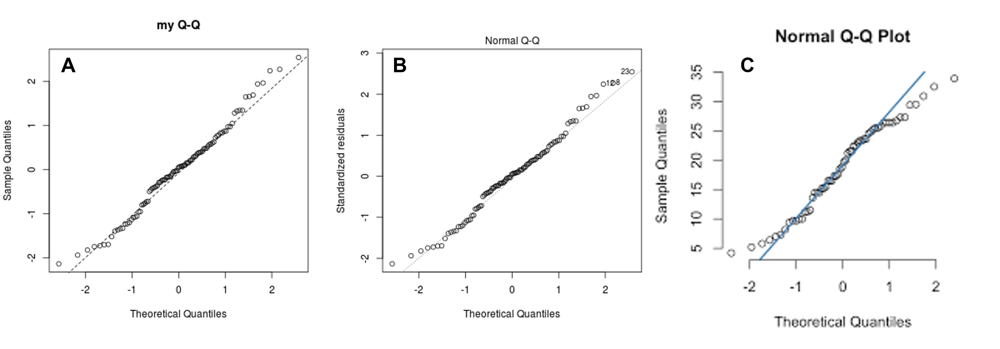
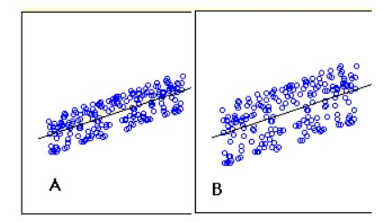
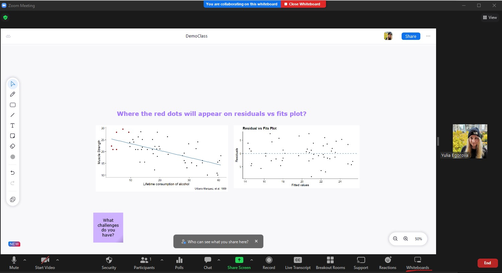
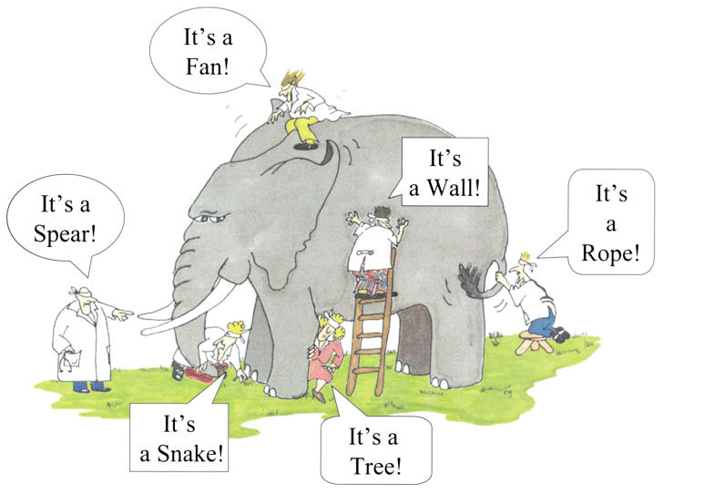

# Student Engagemnet & Learning

How would I engage the students with the topic?

- Show relevance to students
- Promoting discussion through questioning or productive failure
- Being energetic & positive
- Not giving up on students:
    - *I almost gave up on stat till I met Yulia.*

::: fragment
How would I assist them in attaining your learning outcomes?

- Various forms of assessments & tools
- Understanding student's struggles  

::: 

## Summative Assessments 

**Quiz:**

If you Google "Q-Q plots" and look at the available images, you will see the 3 types of Q-Q plots. an example of each type is shown below.
All three plots show Theoretical Quantiles on x-axes, but can have different y-axis: A) Residuals; B) Standardized residuals, and C) Sample Quantiles. Which of the following option would you use to assess the normality assumption? Explain your choice.

{width=80%}

----------------

Two fitted regression lines (A & B) on randomly generated data are shown in the figure below (x- axis shows the independent variable and y-axis shows dependent variable). Which ONE of the following statement is true about sum of residuals of A and B? Assume the scale is the same between the graphs.

1. A has higher sum of residuals than B
2. A has lower sum of residual than B
3. Both have same sum of residuals
4. None of these

----------------------------------------------

**Lab activity:**

- Good for in-depth analysis
- Can include reflection / synthesis questions
- Important to have access to frequent office hours 
- Reflection question

--------------------------------------------------------------------

## Formative Assessments 

- Questions directed to students
- List things you have learnt today
- List things you are curious about?

# Technology

- Interactivity during the lecture:
  - allows drawing/annotations:
  - Miro interactive boards: https://miro.com/app/dashboard/ 
  - new Zoom Whiteboard feature
  - {width=60%}
  
-----------------------------------

- Resources outside the classroom:
  - Slack for discussion
  - Zoom office hours
  - Padlet: https://padlet.com/egorovauu/o9ap22nt8f8vbjj6
  - Interactive tutorials: https://www.zoology.ubc.ca/~whitlock/Kingfisher/KFhomepage.htm 

# Difficulties students might have learning the topic

- Terminology & definitions
- Seeing big picture
- Depth of knowledge & Math skills

{width=40%}

