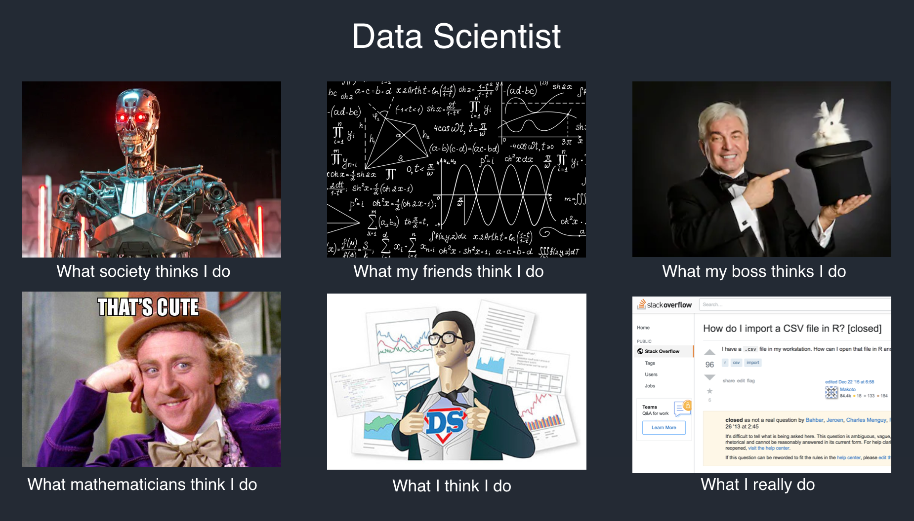

# Why Study Data Science?

1. Technical jobs
2. Everyday living
3. Logical Mind Training

## Data Science offers a full set of problem solving skills:

- defining questions
- translated to language of math/statistics (*real world to "math"*)
- compute results
- interprete/ communicate results (*math to real world*)

no uniform approach to teach DS.

# Data science at the undergraduate level

- Data analytics and data science skills are essential to developing critical thinking, streamlining the work process, and mastering organizational skills. 
- To provide a clear idea of what this field is. Most students have probably heard about the term 'data science' but possess a very vague idea of its meaning and what data scientists do. 
- Computer literacy and skills are more demanding and valuable than ever. 

------------------------------------

I don't think that a single 'information session' will be sufficient 

- Introduction to data science course  
- The overarching theme: iterative 'lifestyle' process of the data science: 
- core principles to formulating questions, experimental design and data collection, data processing, data cleaning and organization, and eventually data analysis. 
- Get acquainted with a plethora of various techniques and methods, along with their strengths, weaknesses, and applicability. 
- Communication of results

-------------------------------------------------------------

If interested, students need to have a chance to explore the field in more detail. 

- Data science is an inherently interdisciplinary area 
- can be taken as a double major or minor along with any other discipline of interest. 
- To design a flexible education program that can address the needs of a diverse community of students,
- This can be accomplished by creating ‘connector’ courses 

Data science students can be a catalyst for new thinking in interdisciplinary approaches. 
- a theory track can be designed to target students with strong theoretical fundamentals 
- important to make more students interested in data science 

# Data science during a transition period

In many universities, a Bachelor's degree in a quantitative subject (such as computer science or statistics) is a prerequisite to getting into a Master of Data Science program. 

UBC takes a different approach by welcoming students with various backgrounds and interests into the field. Such an approach undoubtedly creates more opportunities to increase diversity in the classroom, exposes students to new knowledge from experts in different areas and allows students to learn various skills from their peers. But on the other hand, it also creates a bigger gap between students who are less experienced in maths, statistics, or computer science.

To bridge the gap between the students, I see high value in developing conversion courses to help students with less exposure to coding language and key mathematical concepts and theories to become better prepared. Many students or people who are already working in non-data science may be interested in switching their careers to data science. However, they have very little understanding of what this field is and whether this is what they want to pursue. To accommodate those people, a short crash course (2–4 weeks) will provide the perfect opportunity to learn Python or R, brush up on statistics and hypothesis testing, learn how to work with data, and learn the basic concepts of machine learning. Such courses will help people decide whether data science is really what they are looking for and understand what next steps need to be taken if they become interested in the field. In addition, the cost and time commitment of such courses is low and, hence, are accessible to everyone.

# Data science at the graduate level

Data scientists aim to solve real-world problems, to address domain-specific problems, and to create experiential learning opportunities for students. I am in strong agreement with this part of data science education, as it was the key experience that draw me to the data science field. 
- Engaging students through a capstone project, practicum courses, or short-term work 
- Many opportunities should be created to expose students to cutting-edge developments in data science for further study.

Furthermore, education does not just happen in school and is not necessary for university students only.
- Apart from bringing students to the business world, as educators, we need to bring business owners to us.

Many of them lack insights into the use and effectiveness of data science tools but are eager to learn. I have recently been working under Data Science for Social Good Program (DSSG), where I had a chance to collaborate with Pamela Zevit, Biodiversity Planner for the City of Surrey. Pamela was very interested in working alongside the DSSG program and found our work helpful in answering key questions related to city biodiversity. I am sure there are many people like Pamela who would benefit from a bit more connections with data science students. Overall, I would like to take a more active role in introducing data science to the public.

Moreover, I would like to create and promote bridging courses between different UBC departments. Data science field is multidisciplinary by nature, and it is important to design domain-specific tracks to allow students from various departments to enhance their data skills while working on their projects. For instance, many grad students working on their theses do not have enough statistical training and are not familiar with proper data analysis workflow. On the other hand, some students from a stronger statistics background may lack knowledge in biology, thus finding it difficult to rationalize specific findings with a biology-related project. The balance of mathematics, computer science and domain-specific knowledge can be tailored to various tracks that will reflect the needs of the UBC students.

I also think it is imperative for graduate students to realize that data science is never just about data. A well-rounded data scientist needs not only good analytic skills but also good story-telling abilities. Data literacy should be one of the central themes of data science education. Being able to convey ideas in a clear, effective manner to not only the academia but also the public should be one of the most important requirements in data science curricula. The wide gap between the scientific community and the general audience leads to a variety of misunderstandings. That is why I think that data visualizations and communication skills are two core topics in the data science discipline, as they provide the most intuitive interpretation of the results and the reasonings behind the analysis. I strongly recommend helping data science students gain first-hand experiences in the filed of consulting, so they could learn the proper way to express themselves.

# Distance Education courses & Online Materials

- Visualizing statistics: https://www.zoology.ubc.ca/~whitlock/Kingfisher/KFhomepage.htm 

